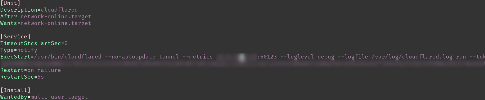

+++
title = "Monitor Cloudflare Tunnel with Grafana"
date = 2024-09-17

[taxonomies]
categories = ["tunneling", "web", "cloudflare", "grafana"]
+++


So I figured I'd give this Cloudflare Tunnel monitoring with Grafana tutorial [here](https://developers.cloudflare.com/cloudflare-one/tutorials/grafana)

The first step is to create a tunnel in Cloudflare! This was all done with a free account which is wonderful. To create a tunnel I used the "dashboard" method instead of the cli by following [these](https://developers.cloudflare.com/cloudflare-one/connections/connect-networks/get-started/create-remote-tunnel/) steps here. 

Then we need to install the cloudflared package on the server we want to expose through the tunnel. I was using Ubuntu Server 24.04 (Noble) which required a little configuration change to get the package working. Here were the steps I followed:

```
curl -fsSL https://pkg.cloudflare.com/cloudflare-main.gpg | sudo tee /usr/share/keyrings/cloudflare-main.gpg >/dev/null
```

```
echo "deb [signed-by=/usr/share/keyrings/cloudflare-main.gpg] https://pkg.cloudflare.com/cloudflared $(lsb_release -cs) main" | sudo tee /etc/apt/sources.list.d/cloudflared.list
```

Since this will use the Noble release, it won't work when you install cloudflared because there is no Noble package yet! So I went in and changed the release to jammy which does exist.


Once updated to jammy, you can update and install the package:

```
sudo apt-get update && sudo apt-get install cloudflared
```

<script data-goatcounter="https://tunneleverything.goatcounter.com/count"
        async src="https://gc.zgo.at/count.js"></script>
